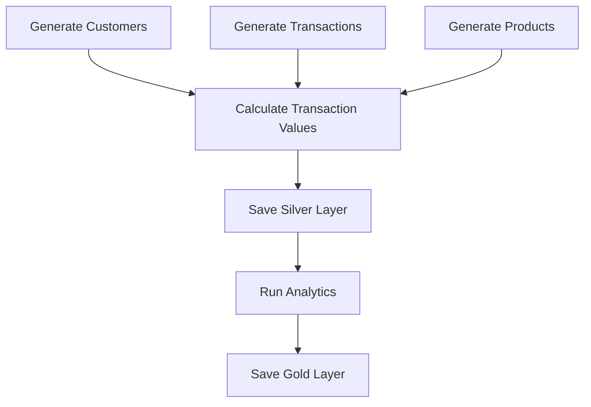
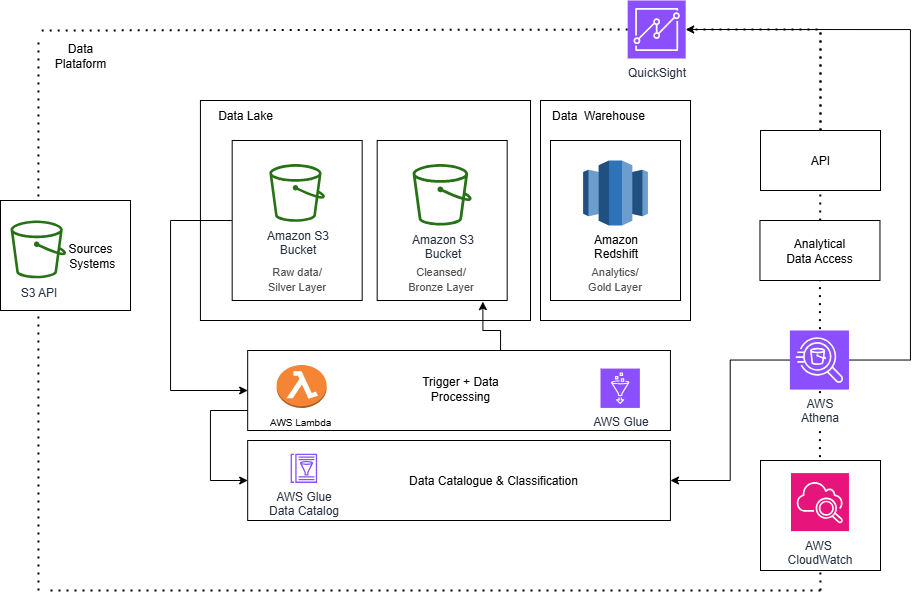
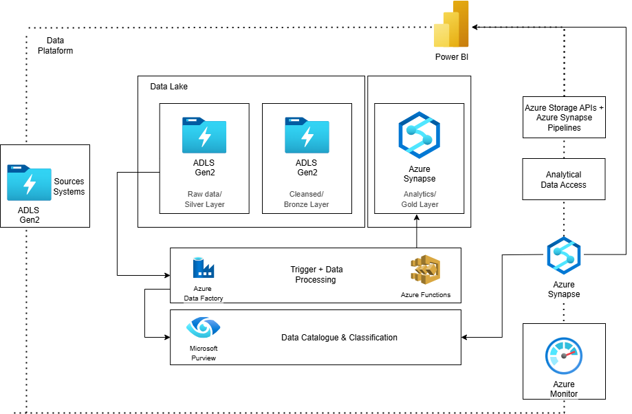

# Documentation

## Overview

This pipeline processes costumers credit card transaction data using a medallion architecture (Bronze - Silver - Gold). It generates synthetic customer, transaction, and product data, applies transformations, and produces analytics to identify top customers by transaction value.

**Tech Stack:** Apache Spark, Python, Faker, Parquet, JSON

## Architecture

```
Bronze (Raw Data)          Silver (Processed)         Gold (Analytics)
├── customers/            └── transactions/          ├── top_customers/
├── transactions/           (partitioned by date)    └── totals_by_provider/
└── products/
```

## Data Flow



## Datasets

### Bronze Layer

**CUSTOMER_DATA (200 records)**
```
CUSTOMER_NUMBER, FIRST_NAME, LAST_NAME, BIRTH_DATE, SSN,
ADDRESS fields, CREDITCARD fields
```

**CREDITCARD_TRANSACTION (2,000 records)**
```
TRANSACTION_ID, CUSTOMER_NUMBER, TRANSACTION_VALUE, TRANSACTION_DATE_TIME
```

**PRODUCT_TRANSACTION (variable records)**
```
TRANSACTION_ID, ITEM_EAN, ITEM_DEPARTMENT, ITEM_VALUE, ITEM_QUANTITY
```

### Silver Layer
- **Transactions**: Updated with calculated values, partitioned by year-month

### Gold Layer
- **Top 100 Customers**: Highest single transaction values
- **Provider Totals**: Aggregated by credit card provider 

## Key Components

| Module | Purpose |
|--------|---------|
| `customer_data.py` | Generate customer records with Faker |
| `transaction_data.py` | Generate transaction records |
| `product_transactions.py` | Generate product items |
| `transactions_update.py` | Calculate transaction updates |
| `write_functions.py` | General write functions |
| `query_data.py` | Analytics queries |
| `main.py` | Pipeline orchestration |

## Execution

### Prerequisites
```bash
pip install pyspark faker
```

### Run Pipeline
```bash
python main.py
```


## Output

- **Top Customers JSON**: 100 top customers with highest transaction values
- **Provider Analytics JSON**: Total quantities and values by credit card provider
- **Partitioned Data**: Silver layer optimized for time-based queries


**Architecture solution:**
# AWS



# AZURE



# Author 
Julia Bento